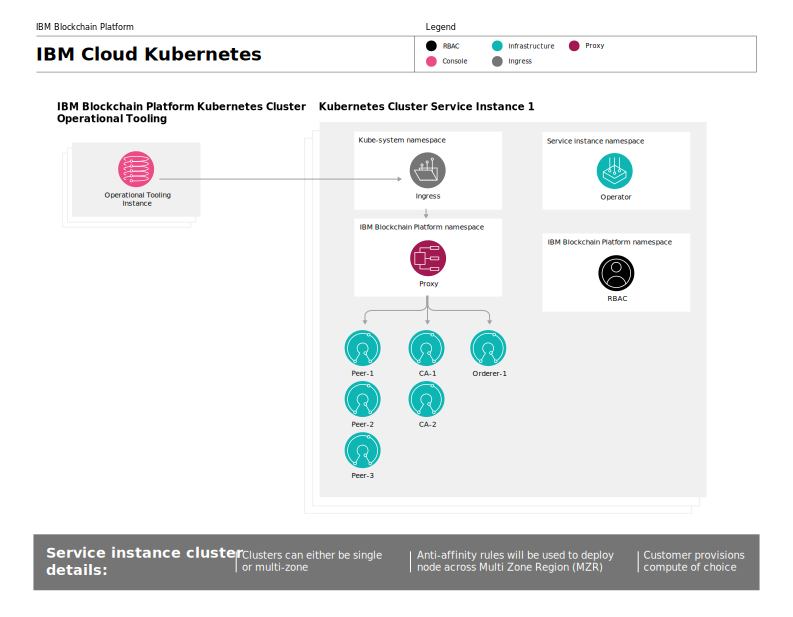
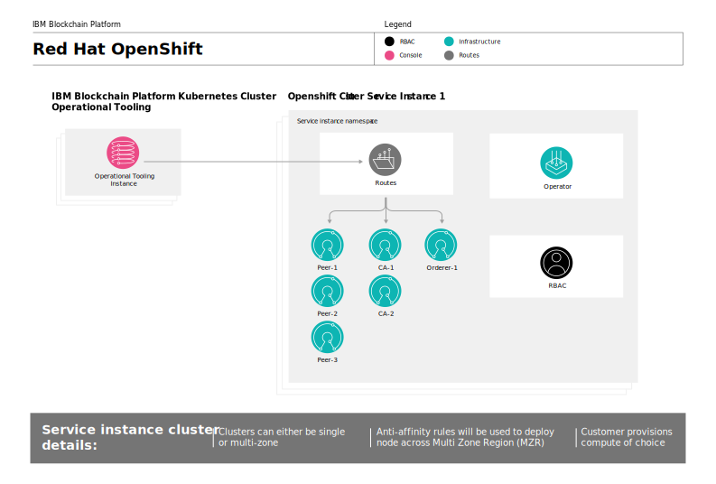
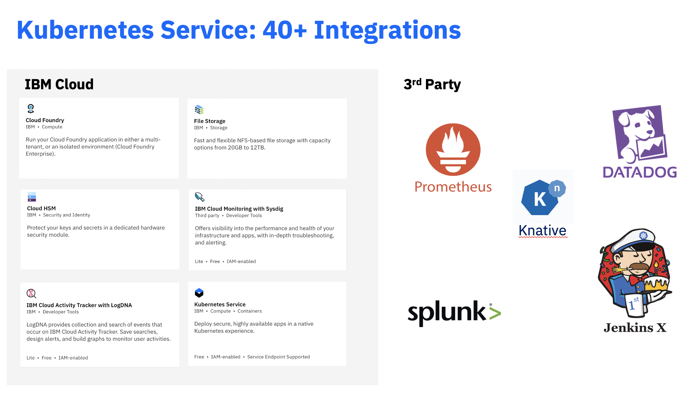

---

copyright:
  years: 2019, 2022
lastupdated: "2022-06-30"

keywords: key features, build, operate, grow, architecture, multizone clusters, compliance, about

subcollection: blockchain

---

{{site.data.keyword.attribute-definition-list}}

# About {{site.data.keyword.blockchainfull_notm}} Platform for {{site.data.keyword.cloud_notm}}
{: #ibp-console-overview}

The {{site.data.keyword.blockchainfull}} Platform for {{site.data.keyword.cloud_notm}} is the next generation of {{site.data.keyword.blockchainfull_notm}} Platform offerings, which gives you total control over your deployments, certificates, and private keys. It includes the new {{site.data.keyword.blockchainfull_notm}} Platform console, a user interface that can simplify and accelerate the process of deploying components into a Kubernetes cluster on {{site.data.keyword.cloud_notm}} managed and controlled by you. For more information about deploying an Kubernetes cluster on {{site.data.keyword.cloud_notm}}, see [Kubeg
Watch the following video for an introduction to blockchain and the {{site.data.keyword.blockchainfull}} Platform:

{: video output="iframe" data-script="#video-transcript-key-concepts" id="youtubeplayer" frameborder="0" webkitallowfullscreen mozallowfullscreen allowfullscreen}

## Video script
{: #video-transcript-key-concepts}
{: notoc}

Video transcript

By now you’ve probably heard of the IBM Blockchain Platform, the leading permissioned enterprise blockchain solution in the world. But what is a permissioned blockchain? And what is the IBM Blockchain Platform? The modern world is interwoven and interactive place.

But under the surface it’s still following some pretty old rules.

Jerry here on the left uses a different record keeping system than Door2Door Logistics on the right, which means they have to spend a lot of time figuring out what the truth is before they can make a deal.

This process is not just slow, it’s vulnerable. A successful hack or other problem can mean records are lost forever. As a result, businesses sacrifice efficiency for security and lock their records away.

But what if businesses shared their records, and shared the burden of protecting them? What if Jerry’s Modern Fabrics and Door2Door Logistics and their business partners never had to spend time arguing over who’s right because every time an asset moves from one to the other everyone’s records updated at the same time? And what if those records, once written, could never been changed?

This network, leveraging what’s called Distributed Ledger Technology, already exists. It’s an open blockchain network like Bitcoin. But there’s a problem. Businesses don’t necessarily want the records of their transactions shared with everyone, especially in a network like Bitcoin where users are unknown. In some industries, it’s actually illegal to share data that way.

What Jerry’s Modern Fabrics and Door2Door Logistics need is a permissioned blockchain like IBM Blockchain Platform, where businesses can form networks with known, established partners and still take advantage of the robustness and efficiency of blockchains. But this too creates a problem. Who owns this network? Who runs it? The answer is: no one does.

Once an IBM Blockchain network has been established, its rules and practices are managed collectively, mimicking the kind of consensus process that governs the way transactions themselves are approved and written to the ledgers in the network.

But the IBM Blockchain Platform doesn’t just stop with permissions and identities, users also have the ability to create channels where a few members of a network can get together and transact privately.

Additionally, private data collections can be established, which allows a few channel members to share certain transactions just with each other, without needing a whole separate channel.

Because components are hosted in clusters that are owned and controlled by users, the IBM Blockchain Platform is naturally compliant with data residency rules.

All of these processes are managed through an award winning UI we call the console, which, along with custom APIs, makes the powerful open-source Hyperledger Fabric blockchain painless to use.

The console integrates seamlessly with the rest of the IBM Blockchain Platform suite, including a powerful VS Code extension which allows users to create and test smart contracts and applications and then package and install them on production networks.

Because the console can run on both IBM Cloud and any cloud supported by Red Hat’s Open Shift, the console can run nearly everywhere and consoles in different clouds can connect to each other and to nodes deployed on Hyperledger Fabric.

But how many CAs, which create identities and define organizations, do I need?

How many peers, which host ledgers and have smart contracts installed on them, should I deploy on a channel to make sure I have no downtime?

Because you only pay for the compute you use, it’s painless to transition from pilot programs to full production networks using the IBM Blockchain Platform. The IBM Garage is here to help assist you in finding the right configuration for every use case.

The world is moving too fast to keep doing things the old way. Go to cloud dot IBM dot com today and check out the IBM blockchain platform.

## What {{site.data.keyword.blockchainfull_notm}} Platform offers
{: #ibp-console-overview-capabilities}

This latest release is tailored to experienced {{site.data.keyword.blockchainfull_notm}} and Hyperledger Fabric users and lets them host and join {{site.data.keyword.blockchainfull_notm}} networks.

The {{site.data.keyword.blockchainfull_notm}} Platform includes the following key features:

**BUILD ---- Integrated developer experience**
- **Deploy easily**. Use Ansible Playbooks or the Red Hat Marketplace to deploy networks quicker than ever before.
- **Easily code** your [smart contracts](#x8888420){: term} in Node.js, Golang, Java, or JavaScript. Use the {{site.data.keyword.blockchainfull_notm}} Platform Developer Tools to easily develop smart contracts locally. Leverage **SDK integration** with the console, and learn from our rich tutorials and samples.
- **Simplified DevOps** allows you to move from development to test to production in a single environment by scaling up your Kubernetes resources to add more components.
- **Up-to-date Fabric key features**. Choose which version of Hyperledger Fabric you want to use when deploying peers or ordering nodes. Leverage the latest features of Hyperledger Fabric v1.4.12 and v2.2.5:
    - [Smart contract lifecycle](https://hyperledger-fabric.readthedocs.io/en/release-2.2/chaincode_lifecycle.html){: external}
    - [Raft ordering service](https://hyperledger-fabric.readthedocs.io/en/release-2.2/orderer/ordering_service.html#raft){: external}
    - [Private data collections](/docs/blockchain?topic=blockchain-ibp-console-smart-contracts-v2#ibp-console-smart-contracts-v2-private-data) that provide increased data privacy by ensuring that ledger data is shared to only authorized peers via the gossip protocol.
    - [Fabric Node OUs](https://hyperledger-fabric.readthedocs.io/en/release-2.2/membership/membership.html#node-ou-roles-and-msps){: external}
    - [Service discovery](https://hyperledger-fabric.readthedocs.io/en/release-2.2/discovery-overview.html){: external}, allowing you to dynamically discover and update how your application interacts with your network.
    - [Channel access control lists](https://hyperledger-fabric.readthedocs.io/en/release-2.2/access_control.html){: external} that allow you additional control of the governance of your channels and smart contracts.

**OPERATE --- Total control of your deployments**
- **Host or join a network**. Deploy peers that are hosted in your cluster to multiple channels on multiple clouds, or invite other organizations to join your consortium or channels while the organizations manage their nodes independently across infrastructures.
- **Maintain complete control of your identities**. Store and manage the keys that are used to administer your nodes. Optionally, use a [Hardware Security Module (HSM)](#x6704988){: term} to generate and store the private key of your nodes.
- **Run Anywhere**. Thanks to the **unified codebase** of the {{site.data.keyword.blockchainfull_notm}} Platform console, it is possible to run your components on any environment supported by {{site.data.keyword.cloud_notm}} and third-party public clouds.
- **Unified operation**. The {{site.data.keyword.blockchainfull_notm}} Platform console allows you to deploy and manage all of your organizations and nodes in **one console**. You can also add or remove members from a blockchain consortium, create and join channels, and deploy smart contracts from your console.
- **Dynamic signature collection** that allows better control over collaborative governance over channel configurations.
- **Elimination of Docker-in-Docker for smart contracts** allows smart contract pods to be run more securely, without peers needing privileged access.
- **Manage access** of the users who can administer or monitor your nodes.
- **Interact directly with your pods** using the Kubernetes dashboard.
- **Direct access to the logs** of your nodes from your {{site.data.keyword.IBM_notm}} Kubernetes service. Use the {{site.data.keyword.la_full_notm}} or any supported third-party service to extract and analyze your logs.
- **Kubernetes service integration.** Leverage services such as {{site.data.keyword.la_full_notm}} for logging and Prometheus and {{site.data.keyword.mon_full_notm}} for monitoring. Leverage the built-in {{site.data.keyword.cloud_notm}} services, such as {{site.data.keyword.cloud_notm}} Kubernetes Service and OpenShift dashboards, {{site.data.keyword.la_full_notm}}, and {{site.data.keyword.cloud_notm}} Identity and Access Management (IAM).
- **Upgrade the Fabric version of your nodes.** Nodes running Fabric version 1.4.x can be [upgraded to 2.x](/docs/blockchain?topic=blockchain-ibp-console-govern-components#ibp-console-govern-components-upgrade). After which, the capabilities of your channels can also be increased to v2.0, allowing full access to the latest Fabric features like the smart contract lifecycle.

**GROW --- Scalability and flexibility**
- **Choose your compute**. You have the flexibility to decide the amount of CPU, memory, and storage you want to provision in your Kubernetes cluster. For more information, see [Allocating resources](/docs/blockchain?topic=blockchain-ibp-console-adv-deployment#ibp-console-adv-deployment-allocate-resources).
- **Scale** up and down the resources in your Kubernetes cluster, paying for only what you need. For more information, see [Pricing](/docs/blockchain?topic=blockchain-ibp-saas-pricing).
- **Disaster recovery and multi-region high availability (HA).** This option duplicates your Kubernetes deployment across zones and  regions, enabling high availability (HA) of your components and disaster recovery (DR).
- **Connect to other Fabric networks**: Join {{site.data.keyword.blockchainfull_notm}} Platform peers to any network running Hyperledger Fabric components. Similarly, you can invite Fabric peers to join channels hosted on an ordering service deployed on the {{site.data.keyword.blockchainfull_notm}} Platform. Note that you will need to use Hyperledger Fabric APIs or the CLI.

This offering is intended for experienced Fabric users who want to build and manage their own networks.

Have questions and want to speak to an {{site.data.keyword.blockchainfull_notm}} Platform expert? [Schedule a consult](https://www.ibm.com/cloud/blockchain-platform/developer?schedulerform){: external} now to learn more about how blockchain can transform your business.

## Supported {{site.data.keyword.cloud_notm}} configuration
{: #ibp-console-overview-supported-cfg}

**Reminder:** {{site.data.keyword.containerlong_notm}} 1.19 is no longer supported. If your {{site.data.keyword.blockchainfull_notm}} Platform instance is linked to an {{site.data.keyword.containerlong_notm}} 1.19 cluster, you must immediately upgrade it to {{site.data.keyword.containerlong_notm}} 1.20 or 1.21. To get started, see [1.20 considerations](/docs/containers?topic=containers-cs_versions#cs_v120) and [1.21 considerations](/docs/containers?topic=containers-cs_versions#cs_v121). For the actual steps that are required, see [Updating clusters, worker nodes, and cluster components](/docs/containers?topic=containers-update#update). For the list of {{site.data.keyword.containerlong_notm}} supported versions and expiration dates see the [release history](/docs/containers?topic=containers-cs_versions#release-history).

| | |
|----|----|
| Kubernetes | <ul><li>v1.20 - v1.23</ul> |
| Orchestration Service| <ul><li>Kubernetes</li><li>OpenShift Container Platform on IBM Cloud 4.6, 4.7, 4.8, 4.9</li></ul> |
| Infrastructure| <ul><li>Classic</li></ul>|
| Hardware Security Module [(HSM)](#x6704988){: term} | <ul><li>Tested with [Cloud HSM ](/docs/blockchain?topic=blockchain-ibp-hsm-gemalto) </ul> |
| [VLAN](#x2438470){: term} | <ul><li>[VLAN spanning](/docs/vlans?topic=vlans-vlan-spanning#manage-vlan-spanning){: external} must be enabled for multi-zone clusters. <li>Because  private ingress is not supported, a cluster with only private VLANs is not supported as a public internet connection is required for a connection between the {{site.data.keyword.blockchainfull_notm}} cluster and the customer Kubernetes cluster. A cluster with private and public VLANs configured is supported. </ul> |
| Storage | <ul><li>File <li> Block <li> Portworx <li> Object (For backups only, not intended for live storage)</ul> |
{: caption="Table 1. Supported {{site.data.keyword.cloud_notm}} configuration" caption-side="bottom"}

### Fabric Component Support
{: #fabric-component-support}

Support for Hyperledger Fabric **v1.4 is now deprecated**, and support for Fabric v1.4 will be removed from  {{site.data.keyword.blockchainfull_notm}} Platform on March 31, 2023. Users should therefore [upgrade to Fabric v2.2](/docs/blockchain?topic=blockchain-ibp-console-govern-components#ibp-console-govern-components-upgrade) as soon as possible. Your applications may require changes as a result of upgrading to v2.2, so please plan for appropriate testing.
Note that Fabric v1.4 has not been supported by the Hyperledger community since April of 2021. In addition, Fabric v1.4 uses Golang v1.14, which is no longer receiving security updates from the Golang community.
{: important}

The following support levels are provided for Hyperledger Fabric v1.4.12 (Deprecated), v2.2.4, v2.2.5, and
Fabric CA v1.5.0 and v1.5.2.

Using IBM Certified Fabric Images, Kubernetes Operator, and Certified Fabric Operations Console **are required for support** and provide Hyperledger Fabric clients with a verified production setup, simplified management and support, and verified security patches.
{: important}

| Fabric Component | Support Level |
|----|----|
| IBM Certified Fabric images deployed using Kubernetes Operator and managed via the Certified Fabric Operations Console image. | All Certified Fabric images include IBM fix support for supported Hyperledger Fabric versions. |
| Supported Environments | Recent [Kubernetes and OpenShift versions](/docs/blockchain?topic=blockchain-ibp-console-overview#ibp-console-overview-supported-cfg) on IBM Cloud, third-party Cloud or local installations. |
| Hyperledger Fabric without IBM Certified Images, Kubernetes Operator or Certified Fabric Operations Console image. | Not included in support - [community support only](/docs/blockchain?topic=blockchain-blockchain-support#blockchain-general-support) |
| Hyperledger Fabric Labs Support | Fabric Operations Console via Certified Image and deployed by Kubernetes Operator is supported. |
| Hyperledger Fabric Open Source Projects - [IBM Blockchain GitHub](https://github.com/ibm-blockchain) | Open source projects are not included in support, with the exception of [Ansible](/docs/blockchain?topic=blockchain-ansible). All other open source projects are [community support only](/docs/blockchain?topic=blockchain-blockchain-support#blockchain-general-support). | 
| Hyperledger Fabric SDK and CLI | Basic connectivity diagnostics is supported. Code support and SDK API usage and tuning are not included in support - [community support only](/docs/blockchain?topic=blockchain-blockchain-support#blockchain-general-support). |
| Hyperledger Fabric Chaincode | Basic chaincode diagnostics is supported. Code support and tuning are not included in support - [community support only](/docs/blockchain?topic=blockchain-blockchain-support#blockchain-general-support). |
| Deployment Architecture and Design | Basic deployment and management of highly available [peer](/docs/blockchain?topic=blockchain-ibp-console-ha#ibp-console-ha-peers), [orderer](/docs/blockchain?topic=blockchain-ibp-console-ha#ibp-console-ha-ordering-service), and [Certificate Authority](/docs/blockchain?topic=blockchain-ibp-console-ha#ibp-console-ha-ca) nodes via the Console are supported. Detailed Deployment Architecture and Design are not included in support - see [deployment options](/docs/blockchain?topic=blockchain-ibp-console-adv-deployment) for more information. |
| Solution Architecture and Design | [Deploying and managing smart contracts](/docs/blockchain?topic=blockchain-ibp-console-smart-contracts-v2) via the Console are supported. Solution Architecture and Design are not included in  support. |
| Performance Tuning | [Resource allocation](/docs/blockchain?topic=blockchain-ibp-console-adv-deployment#ibp-console-adv-deployment-options) via the Console is supported. Detailed performance analysis and tuning of the environment or application code are not included in support - see the documentation on creating [highly available applications and using indexes with CouchDB](/docs/blockchain?topic=blockchain-ibp-console-app#console-app-couchdb). |
| Certificate Renewal | [Automatic and Manual](/docs/blockchain?topic=blockchain-cert-mgmt#cert-mgmt-renew-expiration) Certificate renewal via the Certified Console image is supported. The user is responsible for keeping track of identities and performing manual certificate renewal. Using a [Certificate Management Solution](/docs/blockchain?topic=blockchain-ibp-console-identities#storing-and-managing-certificates-in-ibm-cloud-certificate-manager) is recommended for keeping track of identities and certificates. |
{: caption="Table 2. Fabric component support" caption-side="bottom"}

## Considerations
{: #ibp-console-overview-considerations}

Before you deploy the console, ensure that you understand the following considerations:

- You are responsible for the management of health monitoring, security, and logging of your Kubernetes cluster on {{site.data.keyword.cloud_notm}}. See this [information](/docs/containers?topic=containers-responsibilities_iks){: external} for details on what {{site.data.keyword.cloud_notm}} manages and what you are responsible for.
- You are also responsible for monitoring the resource usage of your Kubernetes cluster on {{site.data.keyword.cloud_notm}}. To monitor your Kubernetes resources, we recommend using the [{{site.data.keyword.mon_full_notm}}](https://www.ibm.com/cloud/cloud-monitoring) tool in combination with your {{site.data.keyword.cloud_notm}} Kubernetes dashboard. If you need to increase storage capacity or performance of your cluster, see this information on how to [modify your existing volume](/docs/containers?topic=containers-file_storage#file_change_storage_configuration){: external}.
- You are responsible for managing and securing your certificates and private keys. {{site.data.keyword.IBM_notm}} does not store your certificates in the Kubernetes cluster or in the console. They are only kept in the local storage of your browser. If you switch browsers, you will have to import your created identities into that browser.
- {{site.data.keyword.blockchainfull_notm}} Platform is available in select regions. Refer to this topic on [{{site.data.keyword.blockchainfull_notm}} Platform locations](/docs/blockchain?topic=blockchain-ibp-regions-locations) for an updated list.
- The default storage that is pre-selected for you when you provision a Kubernetes cluster in {{site.data.keyword.cloud_notm}} is `Gold`. If you do not want to use the default File Storage that is pre-selected for you when you provision a Kubernetes cluster in {{site.data.keyword.cloud_notm}}, you can provision storage of your choice. See this topic on [Persistent storage considerations](/docs/blockchain?topic=blockchain-ibp-v2-deploy-iks#ibp-console-storage) to learn more.
- If you decide to include {{site.data.keyword.cloud_notm}} multi-zone support in your Kubernetes cluster on {{site.data.keyword.cloud_notm}}, you must provision your own storage. See [Using Multizone (MZR) clusters with {{site.data.keyword.blockchainfull_notm}} Platform](/docs/blockchain?topic=blockchain-ibp-v2-deploy-iks#ibp-console-mzr) for more details.
- You can preview the {{site.data.keyword.blockchainfull_notm}} Platform at no charge for 30 days when you link your {{site.data.keyword.blockchainfull_notm}} Platform service instance to an {{site.data.keyword.cloud_notm}} Kubernetes free cluster. Performance will be limited by throughput, storage and functionality. {{site.data.keyword.cloud_notm}} will delete your cluster after 30 days and you cannot migrate any nodes or data from a free cluster to a paid cluster. If you choose a paid Kubernetes cluster instead of the limited free cluster, you will incur charges for the Kubernetes service to your {{site.data.keyword.cloud_notm}} account.
- Kubernetes clusters that are configured with private VLANs are not supported.

## License and pricing
{: #ibp-console-overview-license-and-pricing}

{{site.data.keyword.blockchainfull_notm}} Platform for {{site.data.keyword.cloud_notm}} introduces a new hourly pricing model based on virtual processor core (VPC) usage. The simplified model is based on the amount of CPU (or VPC) that your {{site.data.keyword.blockchainfull_notm}} Platform nodes consume on an hourly basis, at a flat rate of **$0.29 USD/VPC-hour**, where **1 VPC = 1 CPU**. See this topic on [Pricing](/docs/blockchain?topic=blockchain-ibp-saas-pricing) for more details.

## Getting started
{: #ibp-console-overview-deploy}

For information about how to deploy {{site.data.keyword.blockchainfull_notm}} Platform for {{site.data.keyword.cloud_notm}}, see [Getting started with {{site.data.keyword.blockchainfull_notm}} Platform for {{site.data.keyword.cloud_notm}}](/docs/blockchain?topic=blockchain-ibp-v2-deploy-iks#ibp-v2-deploy-iks).

For more information about how to use the console to start deploying nodes and building consortium, see the [Building your network](/docs/blockchain?topic=blockchain-ibp-console-build-network#ibp-console-build-network) tutorial. This tutorial guides you through the process of using the console to create a sample network with three organizations, one ordering organization, two peer organizations, and a channel with two peers joined to it. You can use this sample network to for demos or proofs of concept or adjust and expand the steps in the tutorial to create your own custom blockchain configuration.

## Architecture reference
{: #ibp-console-overview-architecture}

The following illustrations show the components of your blockchain network and how they interact with your cluster.

### {{site.data.keyword.blockchainfull_notm}} Platform on {{site.data.keyword.cloud_notm}} Kubernetes Service Architecture
{: #ibp-console-overview-architecture-iks}

{: caption="Figure 1. Architecture diagram of {{site.data.keyword.blockchainfull_notm}} Platform on {{site.data.keyword.cloud_notm}} Kubernetes Service" caption-side="bottom"}

Notice how a single instance of the console, also known as Operational Tooling, is created for each {{site.data.keyword.blockchainfull_notm}} Platform Service Instance. When a peer, orderer or CA node is deployed by using the console, it is deployed into the **Kubernetes Cluster Service Instance**.

| **{{site.data.keyword.blockchainfull_notm}} Platform Kubernetes Cluster** | **Description** |
| ------------------------- |-----------|
| Operational Tooling | Also known as the "console", this is your central user interface for operating all of your blockchain components. With this console you can create CA, peer, and ordering nodes, create channels and use smart contracts developed with IBM's VS Code extension. The console is deployed in an {{site.data.keyword.IBM_notm}}-owned cluster. There is no charge for this tooling or the Kubernetes cluster on {{site.data.keyword.cloud_notm}} where it runs.|

{: caption="Table 2. Components that reside in the {{site.data.keyword.blockchainfull_notm}} Platform Kubernetes Cluster" caption-side="bottom"}

| **Kubernetes cluster on {{site.data.keyword.cloud_notm}} instance** | **Description** |
| -------------- | ----------- |
| **Operator** | A Kubernetes operator that is used to deploy the console. |
| **Ingress** | A [Kubernetes object](https://kubernetes.io/docs/concepts/services-networking/ingress/){: external} that allows access to the cluster resources from outside the cluster. |
| **Proxy** | The {{site.data.keyword.blockchainfull_notm}} Platform proxy is responsible for routing traffic to the correct peer, CA and ordering nodes by using host header routing. |
| **Peers, CAs, ordering nodes** | These are the nodes that are created. These nodes can also be imported from other consoles. Because the private keys are never stored by {{site.data.keyword.IBM_notm}}, every peer and ordering node includes a gRPC web proxy that allows the console to communicate with each node by using the keys in the wallet. |
| **RBAC** | Role based access control.  The {{site.data.keyword.blockchainfull_notm}} Platform configures [Kubernetes RBAC](https://kubernetes.io/docs/reference/access-authn-authz/rbac/){: external} in the cluster which is required to manage blockchain components in the cluster. |

{: caption="Table 3. Components that reside in the customer Kubernetes Cluster" caption-side="bottom"}

### IBM Blockchain Platform on Red Hat OpenShift Architecture
{: #ibp-console-overview-architecture-ocp}

{: caption="Figure 2. Architecture diagram of IBM Blockchain Platform on Red Hat OpenShift in {{site.data.keyword.cloud_notm}}" caption-side="bottom"}

A single instance of the console, also known as Operational Tooling, is created for each {{site.data.keyword.blockchainfull_notm}} Platform service instance. When a peer, ordering node, or CA is deployed by using the console, it is deployed into the **Red Hat OpenShift Cluster Service Instance**.

| **{{site.data.keyword.blockchainfull_notm}} Platform Red Hat OpenShift Cluster** | **Description** |
| ------------------------- |-----------|
| Operational Tooling | Also known as the `console`, this is your central user interface for operating all of your blockchain components. With this console you can now create CA, peer, and ordering nodes, create channels and use smart contracts developed with IBM's VS Code extension. The console is deployed in an {{site.data.keyword.IBM_notm}}-owned cluster. There is no charge for this tooling or the Kubernetes cluster on {{site.data.keyword.cloud_notm}} where it runs.|
{: caption="Table 4. Components that reside in the {{site.data.keyword.blockchainfull_notm}} Platform Kubernetes Cluster" caption-side="bottom"}

| **OpenShift cluster** | **Description** |
| ---------- | -----------|
| **Operator** | A Kubernetes operator that is used to deploy the console. |
| **Routes** | An OpenShift route is a way to expose a service by giving it an externally reachable hostname. |
| **Proxy** | The {{site.data.keyword.blockchainfull_notm}} Platform proxy is responsible for routing traffic to the correct peer, CA and ordering nodes by using host header routing. |
| **Peers, CAs, Ordering nodes** | These are the nodes that are created. Note: these nodes could also be imported from other Kubernetes Cluster Service Instances. Because the keys are never stored by {{site.data.keyword.IBM_notm}}, every peer and ordering node includes a gRPC web proxy that allows the console to communicate with each node by using the keys in the wallet. |
| **RBAC** | Role based access control. The {{site.data.keyword.blockchainfull_notm}} Platform configures [OpenShift RBAC](https://docs.openshift.com/container-platform/4.3/authentication/using-rbac.html){: external} in the cluster which is required to manage blockchain components in the cluster. |

{: caption="Table 5. Components that reside in the customer Red Hat OpenShift Cluster" caption-side="bottom"}

## Integrating with {{site.data.keyword.cloud_notm}} and other third-party services
{: #ibp-v2-deploy-iks-integrations}

{{site.data.keyword.blockchainfull_notm}} Platform can leverage a suite of services provided in the {{site.data.keyword.cloud_notm}} catalog to enable users more visibility into their network or to integrate with other services.

{: caption="Figure 2.{{site.data.keyword.cloud_notm}} Integrations" caption-side="bottom"}

**Access control**  
- Securely authenticate users and control access to all cloud resources using [{{site.data.keyword.cloud_notm}} Identity and Access Management (IAM)](/docs/log-analysis?topic=log-analysis-work_iam).

**Monitoring**  
- Use [{{site.data.keyword.cloud_notm}} Activity Tracker](/docs/log-analysis?topic=log-analysis-getting-started#getting-started) service to troubleshoot logs in real-time, diagnose issues, and identify problems in your Kubernetes cluster on {{site.data.keyword.cloud_notm}}.

- Use [{{site.data.keyword.cloud_notm}} Monitoring](/docs/monitoring?topic=monitoring-getting-started#getting-started) to monitor the activity and the health of services and applications in the Kubernetes cluster on {{site.data.keyword.cloud_notm}}.

- See this tutorial on how to [Analyze logs and monitor application health with {{site.data.keyword.la_full_notm}} and {{site.data.keyword.cloud_notm}} Monitoring](/docs/solution-tutorials?topic=solution-tutorials-application-log-analysis).

- The {{site.data.keyword.blockchainfull_notm}} Platform peers and orderers are automatically configured to expose a `/metrics` endpoint that Prometheus can use to scrape a wide variety of blockchain metric data. Read more about using [Prometheus in {{site.data.keyword.cloud_notm}}](/docs/compare-and-comply?topic=compare-and-comply-alerts){: external}.

**Storage**  
- Utilize {{site.data.keyword.cloud_notm}} [File](/docs/FileStorage?topic=FileStorage-getting-started) or [Block](/docs/BlockStorage?topic=BlockStorage-getting-started) storage when blockchain nodes are provisioned. See the topic on [Persistent storage considerations](/docs/blockchain?topic=blockchain-ibp-v2-deploy-iks#ibp-console-storage) to learn more about how blockchain integrates with {{site.data.keyword.cloud_notm}} storage options.

- Set up [Portworx](/docs/containers?topic=containers-portworx#portworx) to manage local persistent storage across your containerized databases, or share data between pods across multiple zones.

For more information about available {{site.data.keyword.cloud_notm}} services and other third-party integrations, see this list of [Supported {{site.data.keyword.cloud_notm}} and third-party integrations](/docs/containers?topic=containers-supported_integrations#supported_integrations){: external}.

## Compliance
{: #ibp-console-overview-compliance}

For a list of the current security certifications that {{site.data.keyword.blockchainfull_notm}}  Platform adheres to, see the [Software Compatibility Reports]( https://www.ibm.com/software/reports/compatibility/clarity-reports/report/html/softwareReqsForProduct?deliverableId=58A3B7D0BEE911E5BA010CF56D8211B6){: external}.

## Getting support
{: #ibp-console-overview-support}

For more information about how to get support on {{site.data.keyword.blockchainfull_notm}} Platform for {{site.data.keyword.cloud_notm}}, as well as free blockchain developer resources and support forums that you can use to troubleshoot problems, see [Getting support](/docs/blockchain?topic=blockchain-blockchain-support#blockchain-support).
