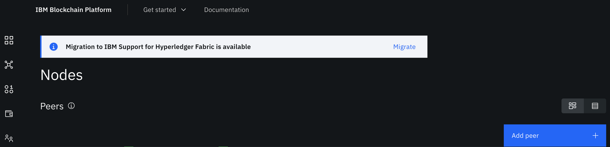

---

copyright:
  years: 2023
lastupdated: "2023-04-19"

keywords: blockchain network, migration

subcollection: blockchain
---


{{site.data.keyword.attribute-definition-list}}


# Migrating to IBM Support for Hyperledger Fabric
{: #migrating-to-hlf-support}

Customers who are currently operating and using {{site.data.keyword.blockchainfull}} Platform (IBP) network Software as a Service (SaaS) edition **must migrate their environment to IBM Support for Hyperledger Fabric by July 31, 2023.** This document, along with step-by-step guidance in your console interface, describe how to complete the migration, which will have no impact on your existing data or blockchain network functionality.
{: shortdesc}

**Target audience:** This topic is designed for network and system administrators who are responsible for planning, configuring and migrating {{site.data.keyword.blockchainfull_notm}} networks.


## What is changing?
{: #ibp-migration-what}

In September, 2021, IBM released the IBM Support for Hyperledger Fabric edition, which provides certified images of Hyperledger Fabric open source code, accelerators, and IBM support for Fabric-based blockchain solutions. Given the functional overlap with the IBM Blockchain Platform Software and SaaS editions, IBM will be withdrawing the IBM Blockchain Platform SaaS edition on July 31, 2023. The [IBM Cloud service withdrawal announcement](https://www.ibm.com/common/ssi/ShowDoc.wss?docURL=/common/ssi/rep_ca/1/897/ENUS922-101/index.html&lang=en&request_locale=en) was published on July 26, 2022.


## Why is it changing?
{: #ibp-migration-why}

To maintain a focused development, delivery, and support effort for IBM Blockchain Platform, IBM Support for Hyperledger Fabric  best recognizes the opensource foundation of the core code and aligns IBM’s value with support, certification, and accelerators.


## How do I transition my license?
{: #ibp-migration-licensing}

IBM Blockchain Platform SaaS PayGo customers can transition their license to IBM Support for Hyperledger Fabric during any month, without any existing long-term customer commitment, through coordination with their IBM Blockchain Support team or IBM Account Representative.

IBM Blockchain Platform SaaS subscription customers will be able to transition their license to IBM Support for Hyperledger Fabric at the end of their current subscription commitment, or before July 31, 2023 (whichever comes first), with assistance from their IBM Blockchain Support team or IBM Account Representative.


## Planning and Considerations
{: #ibp-migration-planning}

IBM Support for Hyperledger Fabric supports the Hyperledger Fabric v2.x codebase (the v1.4 codebase goes out of support in April, 2023) so existing environments need to utilize v2.x component images.

Documentation for the IBM Support for Hyperledger Fabric is a current IBM product offering; the [documentation is available at https://www.ibm.com/docs/en/hlf-support/1.0.0](https://www.ibm.com/docs/en/hlf-support/1.0.0).


## Next steps
{: #ibp-migration-next-steps}

A tool will be provided that migrates your IBM Blockchain Platform console from an IBM-hosted environment to your Kubernetes cluster. Before running this tool, your Kubernetes cluster must be preconfigured with the required Hyperledger Fabric blockchain components, which are your peers, ordering nodes, and certificate authorities. As part of this process, the images used for these components will be switched to images provided for IBM Support for Hyperledger Fabric.

While IBM is testing this migration tool internally for production usage, **there are steps you can take now** to prepare for your migration to IBM Support for Hyperledger Fabric, as follows:

1. Upgrade any blockchain components that are using Hyperledger Fabric v1.4:

    - Hyperledger Fabric v1.4 will **NOT** be supported by IBM Blockchain Platform **after March 31, 2023**. Blockchain components must be upgraded to at least Hyperledger Fabric v2.2 **before March 31, 2023**.
    - [Instructions for upgrading from Hyperledger Fabric v1.4 to Hyperledger Fabric v2.2 are available here.](https://cloud.ibm.com/docs/blockchain?topic=blockchain-ibp-console-govern-components#ibp-console-govern-components-upgrade-v14-v22)

2. Make sure that the Kubernetes version meets the following minimum requirements for migration:

    - Your existing IBM Kubernetes Service must be at version 1.23 or 1.24. Note that the version should be upgraded to 1.24 **before April 26, 2023**, when [support ends for version 1.23](https://cloud.ibm.com/docs/containers?topic=containers-cs_versions).
    - If your existing network is running on OpenShift Container Platform (OCP), the OCP version must be 4.9, 4.10, or 4.11.

3. Make sure that your Hyperledger Fabric v2.2 or v2.4 components are at the prerequisite levels required for migration:

    - Hyperledger Fabric v2.2 components must be at the following levels:  
        a) peers - v2.2.10 or higher  
        b) ordering nodes - v2.2.10 or higher  
        c) certificate authorities - v1.5.5 or higher  

    - Hyperledger Fabric v2.4 components must be at the following levels:  
        a) peers - v2.4.8 or higher  
        b) ordering nodes - v2.4.8 or higher  
        c) certificate authorities - v1.5.5 or higher   

**Attention**: The migration tool will verify the prerequisites above, from your console.

## Running the migration tool

You can access the IBM Blockchain Platform SaaS to IBM Support for Hyperledger Fabric migration tool from the banner on your console.

{: caption="Figure 8. IBM Blockchain Platform SaaS migration to IBM Support for Hyperledger fabric" caption-side="bottom"}

The first page in your console reiterates the prerequisite levels and outlines the migration and details of what happens during the process. Please read that information carefully. This process must be executed for the console for EACH service instance in the participating network (i.e. if you manage more than one IBM Blockchain Platform SaaS instance ID, it would need to be run from each console separately).

From a high-level, the migration process entails the following actions:

1. Checking version compatibility
2. Creating new login credentials for the new customer-hosted console
3. Redeploying the Fabric nodes (CAs, peers, orderers) with the IBM Support for Hyperledger Fabric images
4. Deploying a new console in the IBM Blockchain Platform cluster and copying the console data from the IBM Blockchain Platform SaaS console
5. Exporting the current wallet identities and importing them into the new console

Once launched, the migration tool will walk you through the steps above. Once migrated, start using the [IBM Support for Hyperledger Fabric documentation](https://www.ibm.com/docs/en/hlf-support/1.0.0).


## Post-migration considerations
{: #ibp-post-migration-considerations}

The following scenarios apply once you have completed migration of your IBM Blockchain Platform SaaS network to IBM Support for Hyperledger Fabric.

### Deploying a new SaaS instance

The following steps are required **if** you choose to deploy a new SaaS instance of IBM Blockchain Platform **using the same Kubernetes cluster that you have already migrated to IBM Support for Hyperledger Fabric**.


#### Step 1. Delete the ingressClass field from the configmap ibm-ingress-deploy-config in kube-system namespace

Following migration of a Kubernetes cluster to IBM Support for Hyperledger Fabric, the data values will look similar to the following example:

```
data:
  public-crbtdsmtdd0fs3n12v454g-alb4: '{"enableSslPassthrough":"true","ingressClass":"nginx","tcpServicesConfig":"kube-system/tcp-services"}'
  public-crbtdsmtdd0fs3n12v454g-alb5: '{"enableSslPassthrough":"true","ingressClass":"nginx","tcpServicesConfig":"kube-system/tcp-services"}'
  public-crbtdsmtdd0fs3n12v454g-alb6: '{"enableSslPassthrough":"true","ingressClass":"nginx","tcpServicesConfig":"kube-system/tcp-services"}'
```

Edit the ibm-ingress-deploy-config configmap file (in the kube-system namespace) to delete the ingressClass:

`kubectl edit cm -n kube-system ibm-ingress-deploy-config`

The data values should then be similar to the following example:

```
data:
  public-crbtdsmtdd0fs3n12v454g-alb4: '{"enableSslPassthrough":"true","tcpServicesConfig":"kube-system/tcp-services"}'
  public-crbtdsmtdd0fs3n12v454g-alb5: '{"enableSslPassthrough":"true","tcpServicesConfig":"kube-system/tcp-services"}'
  public-crbtdsmtdd0fs3n12v454g-alb6: '{"enableSslPassthrough":"true","tcpServicesConfig":"kube-system/tcp-services"}'
```
{: codeblock}


#### Step 2. Reload albs to use the new configmap data values

To complete the following step, you must be logged in to your IBM Cloud account. Then run the following command:

`ibmcloud cs alb update -c <Cluster Name | Cluster ID>`


#### Step 3. Restart alb pods

**Make sure all alb pods are restarted in the kube-system** namespace of your cluster** (It will take 5-10 minutes to reflect the configmap changes.)
